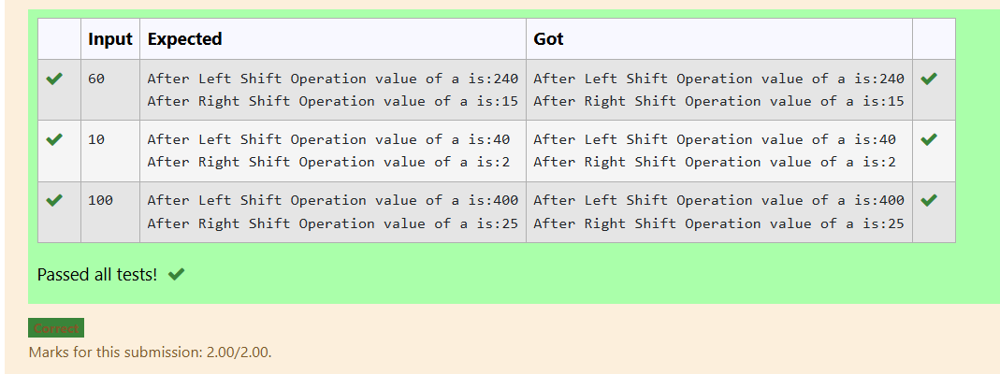
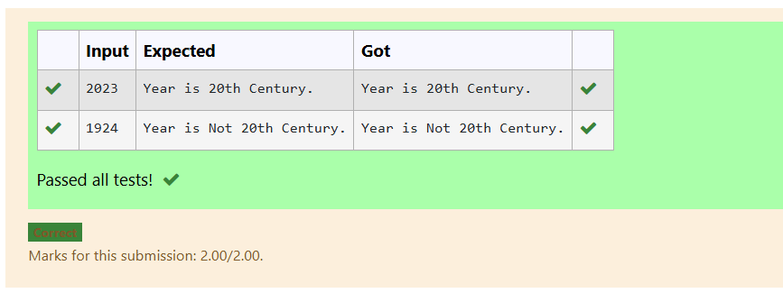
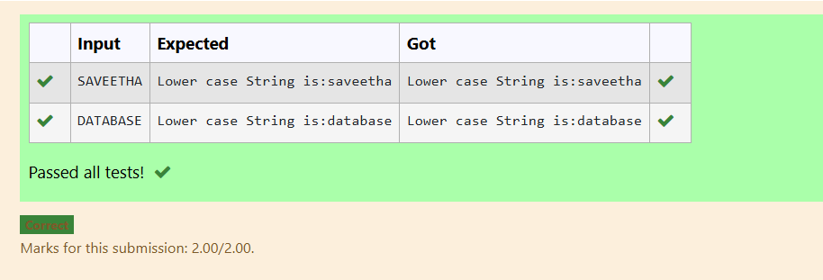
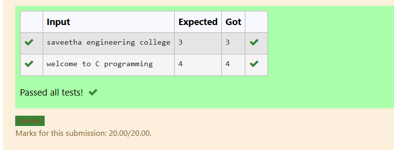
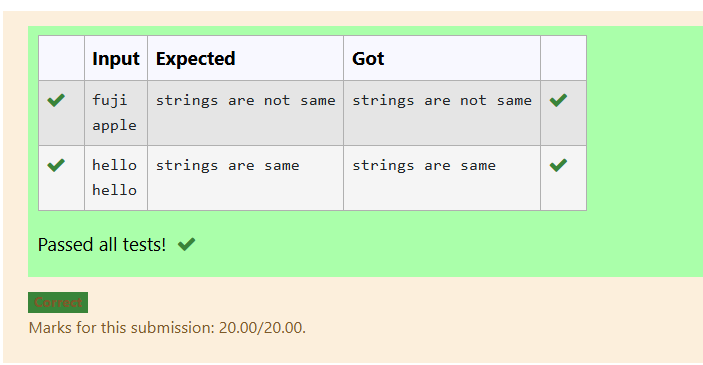

# EX-16-LEFT-SHIFT-OPERATION
## AIM
Write a C program to perform the basic left and right shift operation.  


## ALGORITHM
1. Declare an unsigned integer variable a and an integer variable c.

2. Read the value of a from the user using scanf().

3. Perform left shift operation:

4. Shift the bits of a two positions to the left (a << 2).

5. Store the result in variable c.

6. Print the result.

7. Perform right shift operation:

8. Shift the bits of a two positions to the right (a >> 2).

9. Store the result in variable c.

10. Print the result.


## PROGRAM
```
#include <stdio.h>
int main() {
    unsigned int a ;	/* 60 = 0011 1100 */  
    scanf("%d",&a);
      int c = 0; 
    c = a << 2;     /* 240 = 1111 0000 */
   printf("After Left Shift Operation value of a is:%d\n", c );
   c = a>>  2;     /* 15 = 0000 1111 */
   printf("After Right Shift Operation value of a is:%d\n", c );
}

```

## OUTPUT



## RESULT


Thus, the program to perform left shift and right shift operations on a given number using bitwise operators has been executed successfully.

# EX-17-TWO-NUMBERS-ARE-EQUAL-OR-NOT


## AIM

Write a C program to check whether the entered year is 20th century is valid or not using nested if.


## ALGORITHM

1. Declare an integer variable year.

2. Read the value of year from the user.

3. Check if the year is greater than or equal to 2000 and less than or equal to 2099.

4. If true, print "Year is 20th Century."

5. Otherwise, print "Year is Not 20th Century."


## PROGRAM
```
#include<stdio.h> 

int main() 
{
    int  year;


    scanf("%d", &year);

    if (year >= 2000 ) 
    {

       if(year <= 2099)
    {
        printf("Year is 20th Century.");
    }
}
    else
    {
        printf("Year is Not 20th Century.");
    }

    return 0; 
}
```

## OUTPUT


           
## RESULT

 Thus, the program to check whether the given year belongs to the 20th century has been executed successfully.


 


# EX-18-STRING-LOWERCASE-CONVERSION
## AIM
Write a C Program to convert the given string into lowercase.

## ALGORITHM
1.	Start the program.
2.	Read a string variable.
3.	Using tolower( ) function convert the given string into its lowercase.
4.	Display the result.
5.	Stop the program.

## PROGRAM
```
#include <stdio.h>
#include <string.h>
#include <ctype.h>

int main() {
    char str[100];

 
    scanf("%s", str);  // read the string

    // Convert each character to lowercase
    for (int i = 0; str[i] != '\0'; i++) {
        str[i] = tolower(str[i]);
    }

    printf("Lower case String is:%s\n", str);

    return 0;
}
```
## OUTPUT




## RESULT
Thus the program to convert the given string into lowercase has been executed successfully
 
 


# EX-19-COUNT-OF-WORDS-IN-A-STRING
## AIM
Write a C Program to count the total number of words in a given string using do While loop.

## ALGORITHM
1.	Start the program.
2.	Read a string variable.
3.	Using for loop, inspect the string character by character.
4.	Whenever a space is encountered increment count by 1.
5.	Display the result.
6.	Stop the program.

## PROGRAM
```
#include<stdio.h>
#include<string.h>
int main(){
    int count=1;
    char str[300];
    scanf("%[^\n]",str);
    int v=strlen(str);
    for(int i=0;i<v;i++)
    {
        if(str[i]==' ')
        count++;
    }
    printf("%d",count);
    return 0;
}
```
## OUTPUT



## RESULT
Thus the program to count the total number of words in a given string using do While loop has been executed successfully
 
 


# EX  -20 -COMPARING TWO STRINGS
## AIM
write a Program to compare two strings without using strcmp().
## ALGORITHM
1. Start the program.

2. Declare two character arrays a and b.

3. Read two strings from the user using scanf().

4. Find the lengths of both strings using strlen().

5. If the lengths are equal, print "strings are same", otherwise print "strings are not same"

## PROGRAM
```
#include <stdio.h>
#include <string.h>
#include <ctype.h>

int main()
{
    char a[100],b[100];
    scanf("%s%s",a,b);
    
    int length1=strlen(a);
    int length2=strlen(b);
    if(length1!=length2)
    printf("strings are not same");
    else 
    printf("strings are same");
}
```

## OUTPUT
 

## RESULT
Thus the C Program to compare two strings without using strcmp() has been executed successfully.

